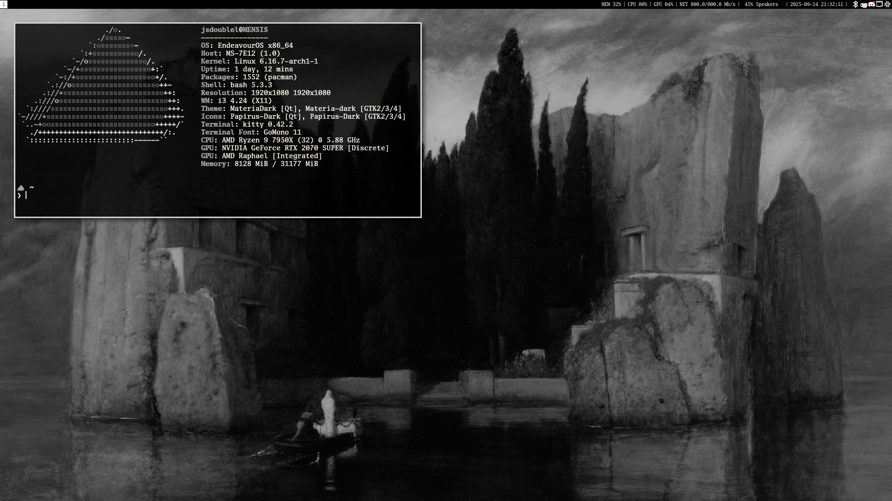

# dotfiles

Dotfiles for my [i3](https://i3wm.org/) [EndeavorOS](https://endeavouros.com/)
desktop. Many of the scripts, etc., are not original to me. Clone the repo with
`--recursive` in order to obtain all the submodules.

The directory layout is desgined with [GNU Stow](https://www.gnu.org/software/stow/) in mind and assumes it is cloned into the path `~/Configs/`. If you want to change this edit `.stowrc`. Once this is set up correctly, running `stow i3-endeavoros` would install the i3 configs and other configs relevant to my desktop setup (like rofi, etc.). `stow */` installs everything.

